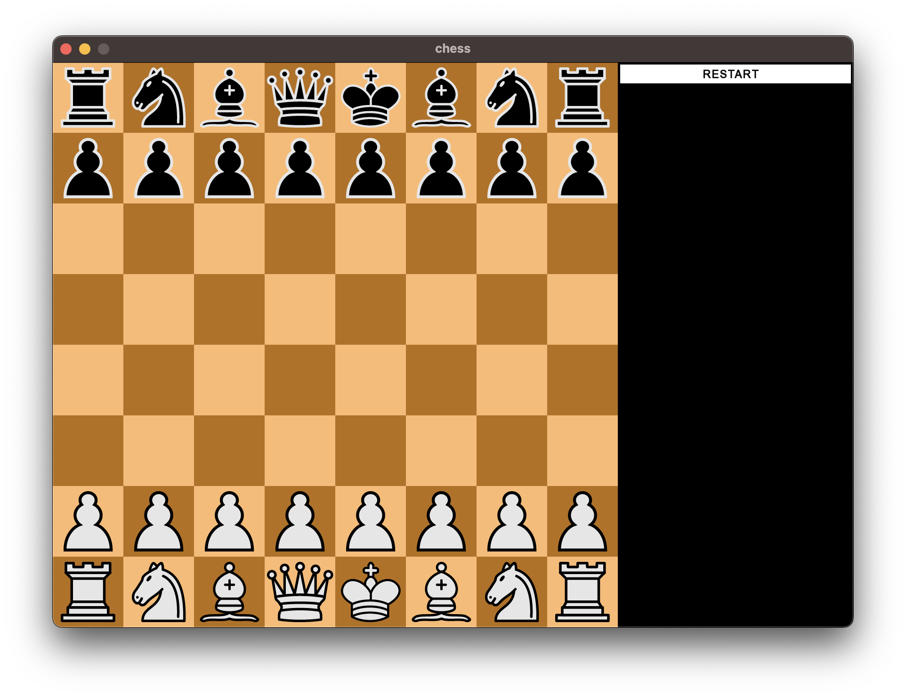
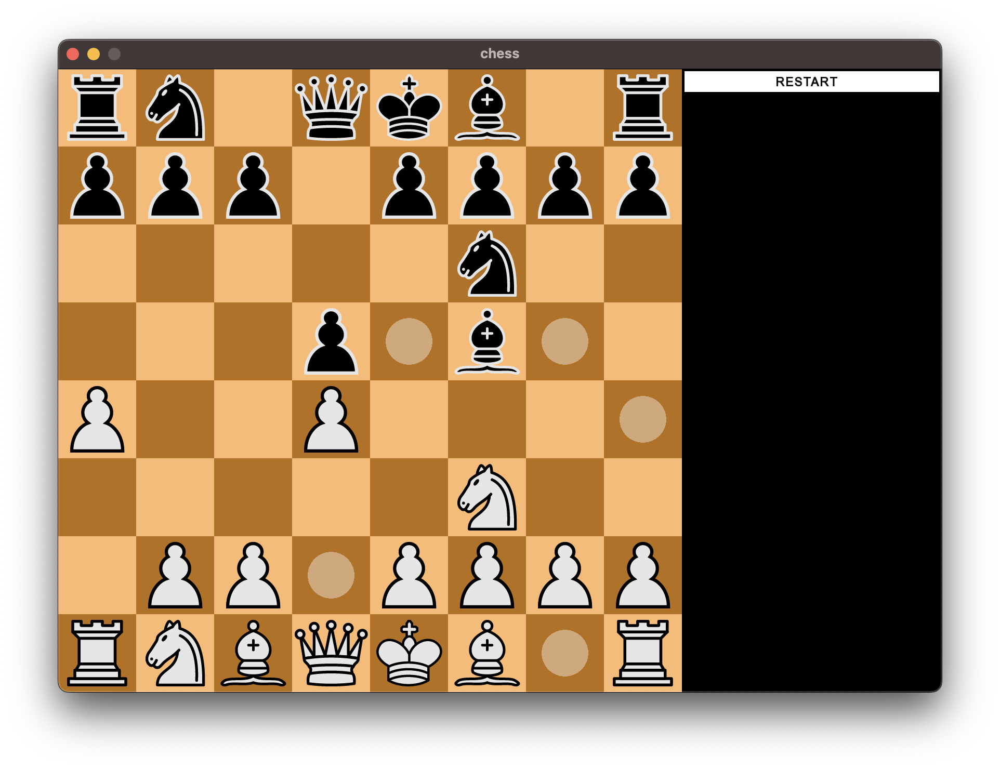
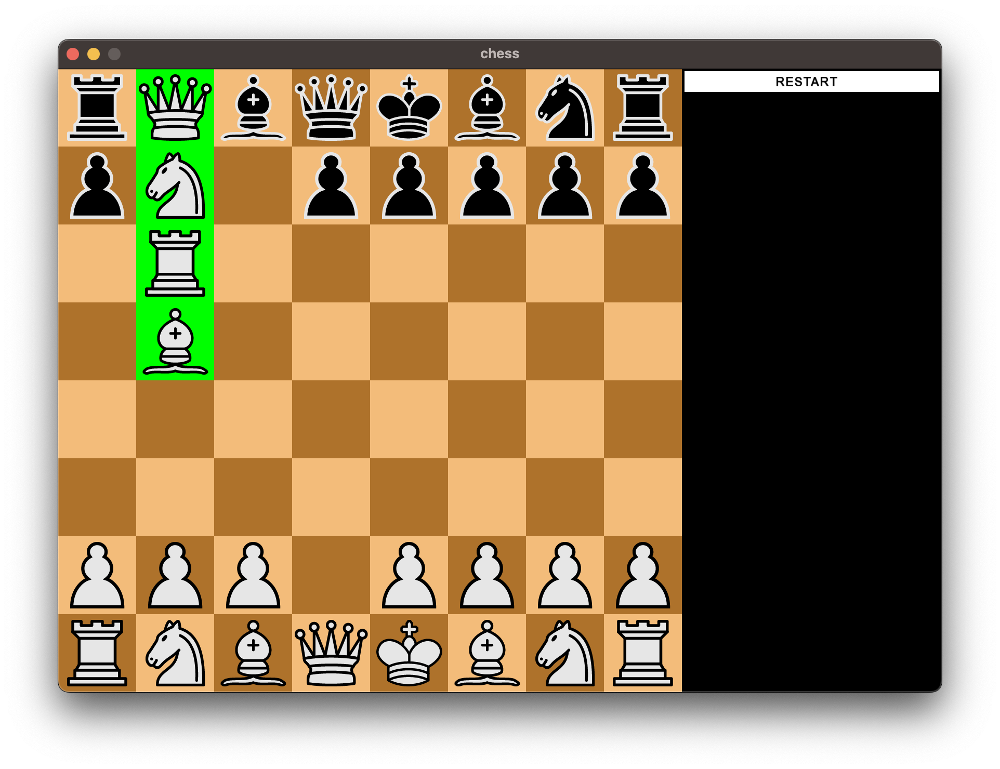
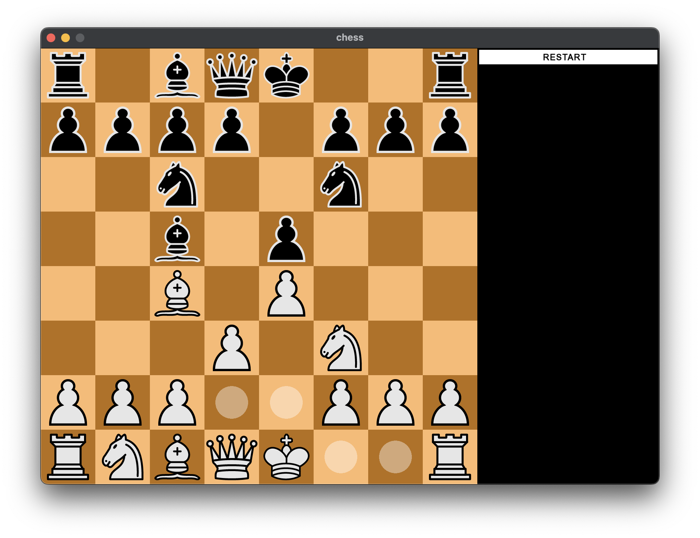
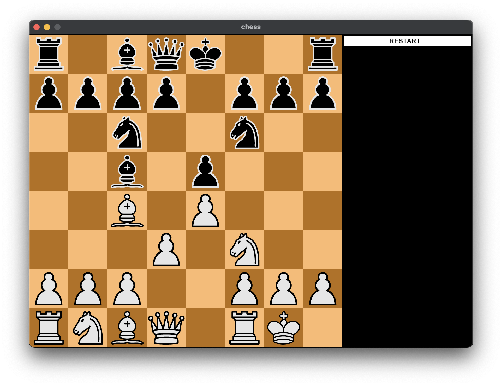

# Chess

This is a simple chess game implemented in C++17 using the SFML for graphics rendering and user interaction.

## Features

- Standard chess rules implemented
- Graphical user interface using SFML
- Human vs. Human gameplay
- Minimalistic design for ease of understanding and extension

## Screenshots








## Requirements

- C++ compiler supporting C++17
- SFML library

## Installation

1. Clone this repository:

    ```bash
    git clone https://github.com/whoami13579/chess.git
    ```

2. Build the project using CMake:

    ```bash
    cd chess
    mkdir build
    cd build
    cmake ..
    make
    ```

## Usage

After building the project, you can run the executable to start the game:

```bash
./chess_sfml
